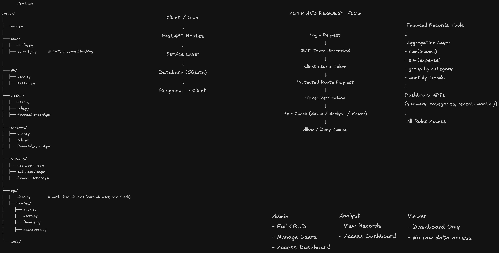

# 📊 Financial Analytics Backend API

A backend system built with **FastAPI** and **SQLite** to manage financial records and provide analytics through a role-based access control system.

---

## 🏗️ Architecture & Request Flow

This diagram illustrates the system architecture, request flow, authentication, and role-based access control.



---

## 🚀 Features

* JWT-based authentication with bcrypt password hashing
* Role-based access control (Admin, Analyst, Viewer)
* Financial records management with filtering and pagination
* Aggregated dashboard analytics (summary, categories, trends, recent activity)
* User management (Admin-only access)

---

## 📬 Sample API Requests

A complete set of test requests is available in `sample_requests.http`, which can be used with the VS Code REST Client extension or tools like Postman.

### Structure

* **API Layer** → Handles requests and responses
* **Service Layer** → Contains business logic and validations
* **Model Layer** → Defines database schema

This separation ensures clean, maintainable, and scalable code.

---

## 🔐 Role-Based Access Control

| Role        | Access                                 |
| ----------- | -------------------------------------- |
| **Admin**   | Full access (CRUD + dashboard + users) |
| **Analyst** | View financial records + dashboard     |
| **Viewer**  | Dashboard only (no raw data access)    |

Authorization is implemented using FastAPI dependency injection (`Depends`).

---

## 📁 Financial Records

* Create, update, delete → **Admin only**
* Read → **Admin & Analyst**

### Filtering

* `record_type` → `income` / `expense`
* `category`
* `start_date`, `end_date`

### Pagination

* `limit`
* `offset`

---

## 📊 Dashboard Analytics

Accessible to **all roles**.

Includes:

* Total income
* Total expense
* Net balance
* Category-wise breakdown
* Recent transactions
* Monthly trends

---

## 📊 Dashboard Scope (Design Decision)

Dashboard data is **global (system-wide)** and not restricted by user.

This ensures:

* Viewer users can access meaningful insights
* Data access remains controlled at the API level (via roles)

---

## ⚙️ Running the Project

```bash
uvicorn main:app --reload
```

Open Swagger UI:

```
http://127.0.0.1:8000/docs
```

---

## 📌 Validation

* `record_type` must be either `income` or `expense`
* Dates follow ISO format (`YYYY-MM-DD`)
* Invalid inputs return HTTP 422 responses

---

## ✨ Additional Improvements

* JWT Authentication
* Pagination support
* Filtering (basic search functionality)
* Structured error handling
* Automatic API documentation via Swagger

---

## ⚖️ Design Tradeoffs

### 1. SQLite vs PostgreSQL

SQLite was chosen for simplicity and ease of setup.
In a production environment, PostgreSQL would be preferred.

---

### 2. Global Dashboard vs User-Specific Dashboard

A global dashboard was chosen to emphasize aggregation logic and system-wide insights.

In a multi-tenant or personal finance system, this would be scoped per user.

---

### 3. Strict Validation vs Flexibility

Strict validation ensures data consistency and reliable analytics, avoiding mismatches in aggregation.

---

## 🧩 Challenges & Learnings

* Ensuring consistency between stored data and aggregation queries
* Designing a clear separation between data access (roles) and data computation (dashboard)
* Handling validation errors and ensuring robust API responses

---

## 👤 Author

Shivansh Goyal

```
